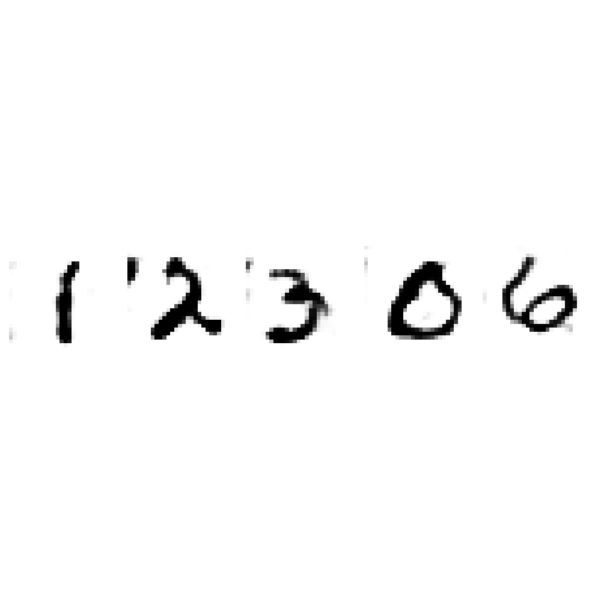
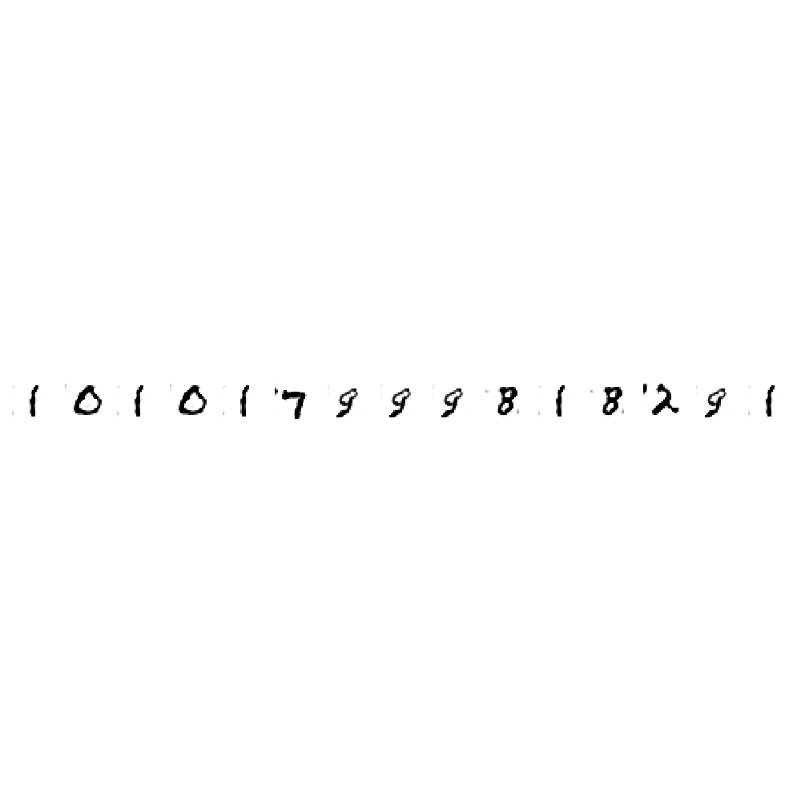
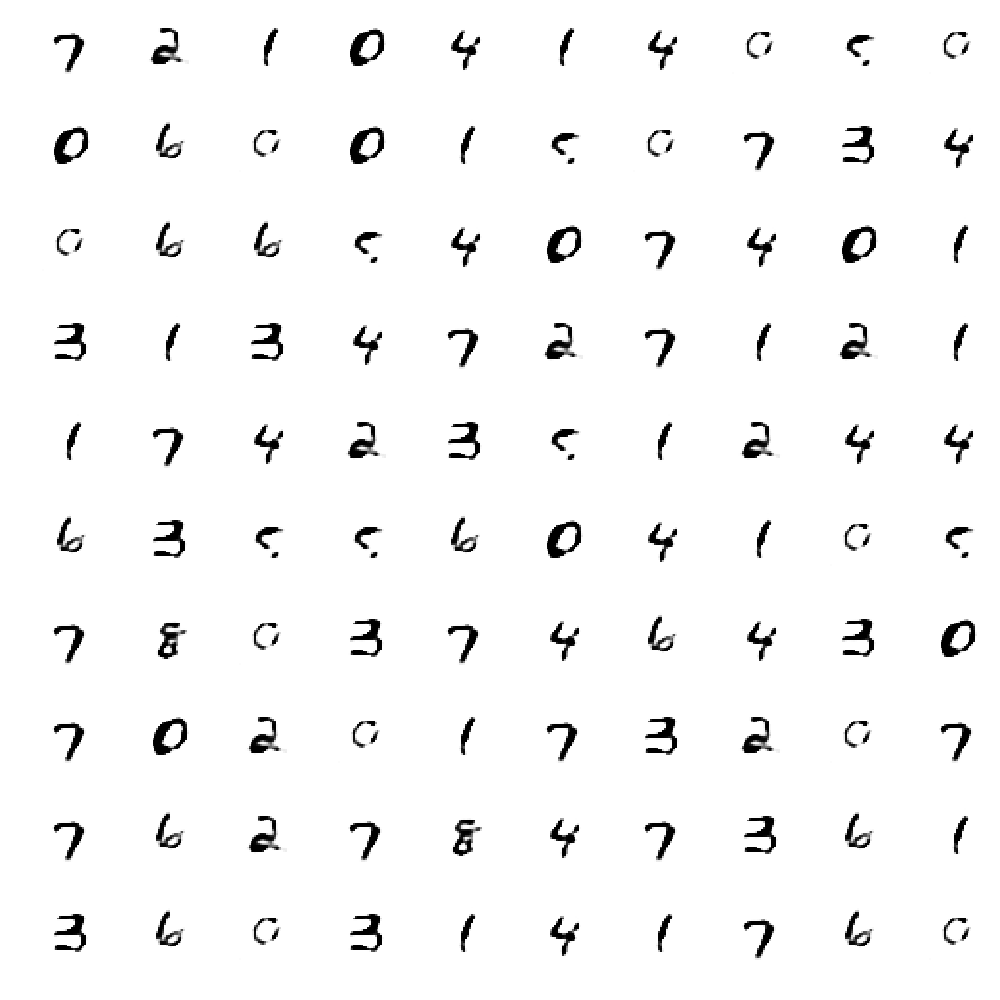
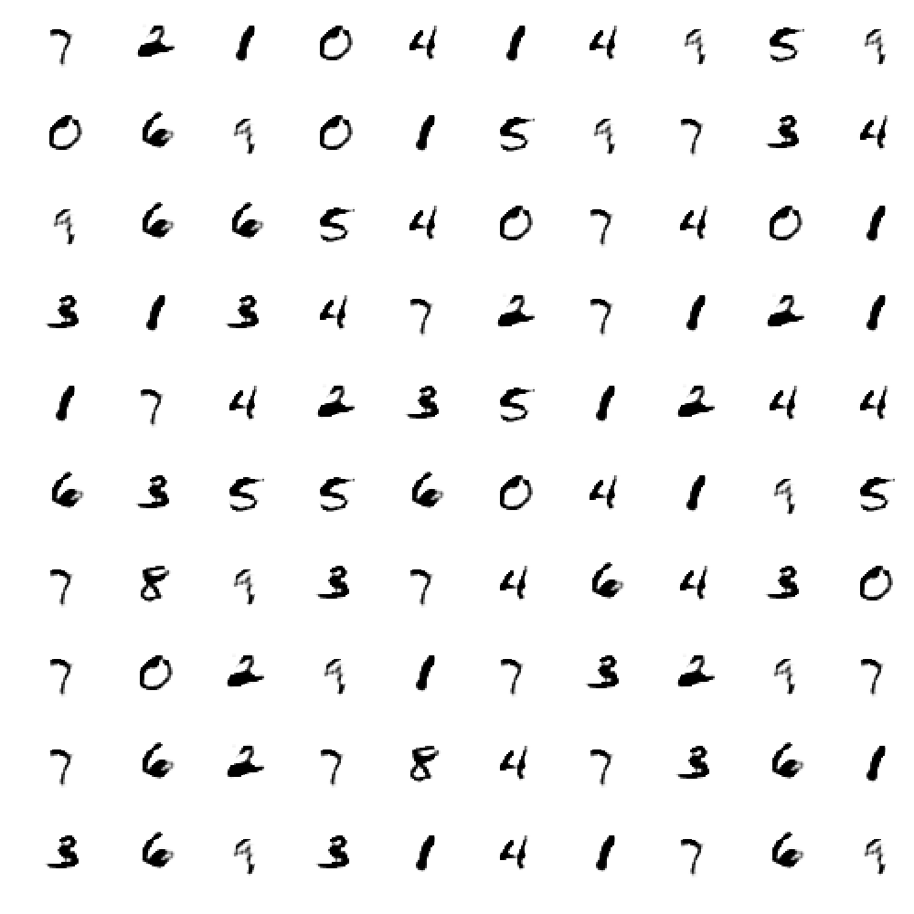
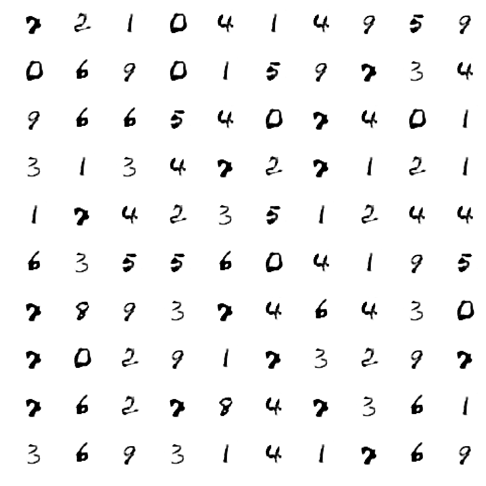

# Num_to_Image

Transfer a series of string into an image, which can be used for building training data for OCR task.
Below is some example of input number and the generated image:
* 12306


* 101017999818291


## Environment 
Basic python package including numpy, matplotlib and Keras. Noticed when installing Keras, the tensorflow backend or theano backend is called. So when installing the Keras, please refer to the [Keras installation instruction](https://keras.io/#installation).

## How to use

### transfering 
An example of command line input
```python
python generate_image.py --number 12306
```
for the parameters:

* number: the numbers for transfering
* model: the model used for generating number, default is "default_model"
* image_width, min_spacing, max_spacing: control the figure's size
* save_file_name: the fig name saved for generated image, default "digit_sequence"


### training 
An example of command line input
```python
python train_model.py
```
for the parameter:

* epoch: the number of epoches that training the model, default is 25

## performance
The numbers that generated at some certain check-point
* Epoch number:5


* Epoch number:15


* Epoch number:24
